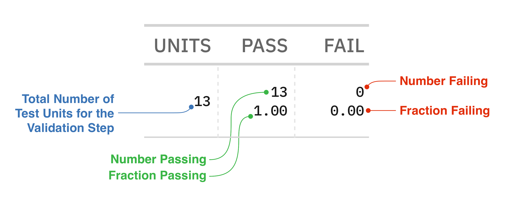

# Getting Started {#sec-getting-started}

```{python}
#| include: false
import pointblank as pb
```

Before you can validate data you need to install **Pointblank** and understand how a basic
validation is structured. This chapter walks through installation, introduces the handful of
concepts that underlie everything the library does, and works a complete example from data to
results, so that by the end you have a working setup, a clear mental model, and the ability to write
and run your own validation plans.

We begin with installation and its optional extras, move through the core ideas of test units,
validation steps, and interrogation, and then build and interrogate a first plan against a built-in
dataset. Along the way we preview the data sources and configuration options that later chapters
develop in full.

## Installing Pointblank

**Pointblank** installs with only the dependencies you ask for, which keeps an environment lean and
avoids the conflicts that come from pulling in more than you need. The base install provides the
core validation functionality.

```{python}
#| eval: false
pip install pointblank
```

Most users want a DataFrame library alongside it, and support for Polars, Pandas, or both installs
through an extra, as does the Ibis backend for whichever database you connect to.

```{python}
#| eval: false
pip install "pointblank[pl]"        # Polars
pip install "pointblank[pd]"        # Pandas
pip install "pointblank[duckdb]"    # DuckDB via Ibis
pip install "pointblank[postgres]"  # PostgreSQL via Ibis
```

The AI-assisted features of @sec-ai-authoring and @sec-semantic-validation need the generation
extra, and the MCP server of @sec-mcp-server needs its own.

```{python}
#| eval: false
pip install "pointblank[generate]"  # language-model features
pip install "pointblank[mcp]"       # the MCP server
```

After installing, a quick import confirms the setup, printing the version without error.

```{python}
print(pb.__version__)
```

The alias `pb` is used throughout this book and the official documentation, and keeping it makes
examples easier to follow and validation code concise when many methods are chained together.

## Core concepts

It is worth a moment on the conceptual model before writing code, because **Pointblank** is more
granular than a tool that returns a single pass-or-fail verdict. It tells you how much of your data
passed or failed and which specific rows had problems, which turns validation from a gate that
blocks bad data into a diagnostic that helps you understand and improve quality over time. Three
ideas, the test unit, the validation step, and interrogation, form the vocabulary the rest of the
book uses.

### Test units

A test unit is the atomic element that a check evaluates, and what counts as one depends on the
check. For a column-value check such as `col_vals_gt()`, each row of the target column is a test
unit, so a check over a thousand-row column has a thousand test units that each pass or fail
independently. For a row check such as `rows_distinct()`, each row of the table is a test unit. For
a table check such as `col_exists()`, there is usually a single test unit standing for the table as
a whole.

{#fig-test-units}

This accounting is what makes results precise. The difference between "your data failed validation"
and "five percent of transactions have negative amounts" is the difference between knowing there is
a problem and knowing its scope, its likely cause, and how to prioritize it, and test-unit counting
is what provides the second.

### Validation steps

A validation step is a single check within a plan, created by one call to a validation method, and a
plan usually holds several. Steps are numbered from one in the order they are added, and those
numbers appear in reports and in the methods that retrieve results. Crucially, steps are
independent, so the failure of one never prevents the others from running, and a single
interrogation gives you the complete picture rather than stopping at the first problem. That is a
deliberate choice: a fail-fast approach would make you run validation repeatedly to discover several
problems, whereas this design surfaces them all at once, which is what makes it useful as a
diagnostic.

### The Validate class

### Interrogation

### Building and running a plan

### Reading results in code

