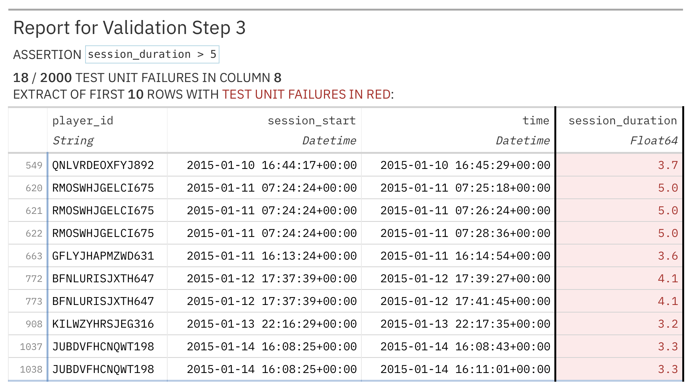

# Reports and Extracts {#sec-reports-extracts}

```{python}
#| include: false
import pointblank as pb
pb.config(report_incl_footer=False)
```

After interrogation, the results need to be presented in a form someone can act on. A person
reviewing the results wants a report that shows what went wrong and lets them look into the details.
When you are debugging, you want the actual failing rows. Another system wants structured data it
can parse. This chapter covers producing each of these. It is a different topic from reading the
raw numbers in code, which @sec-validation-workflow covered, and from responding automatically,
which @sec-thresholds-actions covered.

We use one validation throughout: a plan on `small_table` with three checks that each fail on two
rows, so every report and extract has something to show. With these thresholds, each failing step
reaches the warning level.

```{python}
small_table = pb.load_dataset(dataset="small_table", tbl_type="polars")

validation = (
    pb.Validate(
        data=small_table,
        tbl_name="small_table",
        thresholds=pb.Thresholds(warning=0.1, error=0.25, critical=0.35),
    )
    .col_vals_lt(columns="a", value=7)
    .col_vals_not_null(columns="c")
    .rows_distinct()
    .interrogate()
)
```

We start with the report you have already seen throughout the book.

## The tabular report

The tabular report is the main output for people. Displaying the validation object shows it, and
the `get_tabular_report()` method returns the same thing directly, as a Great Tables object with one
row per step.

```{python}
validation.get_tabular_report()
```

The left side of the report describes what was checked and the right side shows the results. The
step column numbers each check in the order it was added, and that is the number you use to refer to
a step in methods like `get_step_report()`. The columns and values columns show what was checked and
what it was compared against. The test units column gives the total number evaluated, the pass and
fail columns give the split, and the three status columns (warning, error, and critical) show a
filled marker when that threshold was reached. Here all three steps fail on 2 of the 13 rows, which
is a rate of about 0.15, so each one reaches the 0.1 warning level but not the 0.25 error level.

{#fig-report-anatomy}

The `get_tabular_report()` method takes arguments that change what appears, such as a custom
`title=` and the `incl_header=` and `incl_footer=` flags. These are the same settings that earlier
chapters turned off globally with `pb.config()` to keep reports compact.

::: {.callout-note}
## Reports are Great Tables objects

A validation report is a Great Tables object, made by the companion library that Pointblank uses
for its tables. That means you can do anything with a report that you can do with a Great Tables
table, such as restyle it, get its HTML with `as_raw_html()`, write it to an HTML file with
`write_raw_html()`, or save it as an image with `save()`. If you publish reports with Quarto, set
`html-table-processing: none` in your project configuration (this book does). That tells Quarto to
leave the tables alone instead of applying its own table styling.
:::

## The report as a data frame

If you need the report's contents as data rather than as a formatted table, the
`get_dataframe_report()` method returns a data frame with one row per step. Use this form when you
are building a custom dashboard, combining results from many validations, or passing the results to
another tool.

```{python}
report_df = validation.get_dataframe_report()
report_df.columns
```

The data frame has 18 columns. These include the step number and description, the columns and
values checked, the number of test units, the passing and failing counts and percentages, the
threshold results, the `brief`, and whether the step was preprocessed or segmented. Because it is an
ordinary data frame, you can filter it, join it to other tables, or write it to a database. For
example, keeping only the steps with a nonzero `failed_n` and a few columns gives a short list of
what went wrong.

```{python}
import polars as pl

report_df.filter(pl.col("failed_n") > 0).select(
    ["step_number", "columns", "failed_n", "warning"]
)
```

The result lists the three failing steps, each with its column, number of failing rows, and warning
status. The `columns` value for step 3 is null, because `rows_distinct()` looks at whole rows rather
than one column.

## Saving a report to share

You will often want to send a report to a colleague or attach it to a ticket. The Great Tables
object can be written to an HTML file with `write_raw_html()`. The file includes its own styling and
opens in any browser, with no need for Python or Pointblank.

```{python}
#| eval: false
validation.get_tabular_report().write_raw_html("validation_report.html")
```

That saves the report for people to read. If you instead want to save the validation object itself
so you can load it again later, use `pb.write_file()`. By default it saves the validation results
without the data. To include the data or the failing-row extracts, set `keep_tbl=True` or
`keep_extracts=True`.

## Step reports

The tabular report gives you the overview. When a step fails and you want to understand why, the
`get_step_report()` method shows the details of a single step. You pass it the step number from the
tabular report, and it returns a Great Tables view of that step.

```{python}
validation.get_step_report(i=1)
```

The step report shows the step's settings along with the rows that failed it, so for the first check
it shows the two rows where column `a` is not less than 7. You see each failing value in the context
of its full row.

{#fig-step-report}

The method handles one step at a time, so to look at several failing steps you call it once for each
step number, for example in a loop. The `limit=` argument sets the maximum number of failing rows to
show. It defaults to 10, which keeps the report manageable when a step fails on many rows.

## Data extracts

A step report shows failing rows in a formatted view, but often you want those rows as data you can
work with. The `get_data_extracts()` method gives you that. With a step number and `frame=True`, it
returns the failing rows of that step as a data frame.

```{python}
validation.get_data_extracts(i=1, frame=True)
```

The extract has the two rows that failed the first check, with every column of each row rather than
just the one that was checked, so you can look for patterns in the other columns. It also has a
`_row_num_` column giving each row's position in the original table (rows 5 and 7 here), so you can
trace each failure back to the source.

Without a step number, the method returns a dictionary of extracts keyed by step, so you get every
failing row in the plan at once.

```{python}
extracts = validation.get_data_extracts()
{step: frame.shape[0] for step, frame in extracts.items()}
```

Each of the three steps has two failing rows. For step 3, those are the two copies of the duplicated
row. If a step had no failures, it would still appear in the dictionary, with an empty frame, so a
loop over the dictionary always sees every step.

## Sundered data

An extract gives you the failing rows of one step. Sundering splits the whole table into the rows
that passed and the rows that failed, which is useful when a pipeline should carry on with the clean
data and set the rest aside. The `get_sundered_data()` method returns one part at a time, chosen with
the `type=` argument, and each part is the same kind of table as the input.

```{python}
failing_rows = validation.get_sundered_data(type="fail")
passing_rows = validation.get_sundered_data(type="pass")

print("failing rows:", failing_rows.shape[0])
print("passing rows:", passing_rows.shape[0])
```

The table splits into 4 failing rows and 9 passing rows. As explained in @sec-validation-workflow,
sundering only considers the column value checks. So the four failing rows are the ones that failed
the first two steps, and the duplicate rows from `rows_distinct()` are not part of the split. The
passing rows are the clean data you can send downstream, and the failing rows can go to a quarantine
table to be reviewed, fixed, and validated again.

## JSON export and programmatic access

For other systems, the `get_json_report()` method returns the results as a JSON string with the
same per-step detail as the report. You can send it to a logging service, store it in a database to
track results over time, or feed it into a dashboard.

```{python}
import json

report_json = validation.get_json_report()
len(json.loads(report_json))
```

The JSON is an array with one object per step, so there are three here. Each object holds that
step's assertion type, columns, counts, fractions, threshold results, and timing (@sec-validation-workflow
shows a full record). If you only need individual results in Python, such as to decide whether a
pipeline continues, use the methods from @sec-validation-workflow like `all_passed()`,
`n_failed()`, and `critical()` instead. There is no need to parse the JSON for that.

## Step notes

Pointblank sometimes attaches a note to a step to record something that happened while it was
evaluated. For example, a step that uses `pre=` gets a note describing how the preprocessing changed
the table, and a schema check gets a note comparing the expected and actual columns. The
`get_notes()` method returns all the notes for a step, and `get_note()` returns a single note by its
key. If a step has no notes, you get `None`.


## Customizing reports for readers

A default report makes sense to the person who wrote the plan, but a stakeholder who sees
`col_vals_lt` and a column name may need more explanation. The `brief=` argument on each step adds a
plain-language description that appears in the report, so readers can understand what a check is
for without reading code. On the `Validate` object, `tbl_name=` names the data and `label=`
describes the run, and both appear in the report header, which matters when a report is saved and
viewed later on its own. Setting `active=False` on a step keeps it in the plan but skips it during
interrogation, which is a way to keep a suspended check in the plan without deleting it. Briefs are
covered in more detail in @sec-validation-workflow.

## Summary

